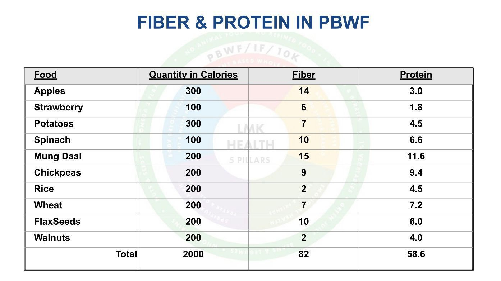

# Fiber & Protein in PBWF

A question that often gets asked is that for those people who go to gym and workout a lot, should they take extra protein or protein supplements. Here is my response to that. 👇

Human body recycles 85% of the protein. An average person has a wear and tear of 200 grams a day, so 170 grams gets recycled and 30 grams need to be replenished. This happens because some proteins can not be recycled like nails, hair, dead skin etc. 
When people work out more in Gym the wear and tear is more but the protein lost in nails, hair, skin etc. remains the same. So their recycle rate is better than 85%. Secondly, heavy workout means more calories spent which in turn means these people consume more calories in food. So these extra calories are already providing extra protein. So the composition of the diet doesn’t have to have more protein; 8% is more than enough.

As you can see in table above there is more than enough protein in PBWF diet to satisfy everyone’s needs. I have repeatedly maintained that there is not a single case of protein deficiency in the civilized world. If you are getting enough food, you for sure are getting enough protein. 
There are some people who are extra cautious and like to worry about things. They really should be focusing on how to get fiber and HOW NOT to get too much protein. That is lot more challenging. On the days we fast we should break our fast with a diet low in protein. So finding PBWFood with low protein is a much bigger challenge.

