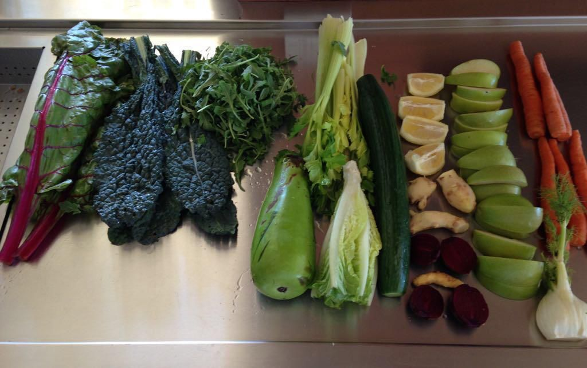

# GREEN  JUICING

## SOME OBSERVATIONS:
Based on my experience in several health groups, I want to share four observations:
1. Somethings are easier said than done. Eating green leafy vegetables and not eating oil/ghee are two such advice. The only way we Indians know how to eat green leafy vegetables is by making saag which cannot be made without ghee. 
2. It is often difficult to give up our favorite foods even after we have learned that they are unhealthy. It is lot easier to add foods and specially foods that are tasty. When we add healthy food it crowds out the unhealthy food.
3. When we make changes slowly the improvements are not noticeable and one often looses confidence. So it helps to make some changes which are dramatic and remain in our conscious mind. 
4. One conscious change often leads to many unconscious changes and benefits accrue. To give you one example, once I started walking for an hour every day I started rejecting caloric dense food like cookies and donuts because I was conscious that it would wash off my one hour worth of effort. 

## JUICING DOCUMENTARIES
Before we move on to the subject of “How to Eat”,   I request all to watch a documentary “Fat Sick and Nearly Dead”. This is available on Netflix. The second documentary “Super Juice Me” is available on YouTube and linked above. 

## GREEN JUICING  
I had discussed in the dietary guidelines that we need to consume a minimum 1% of our body weight in vegetables and half of that should be in green leafy vegetables. In fact Dr. Caldwell Esselstyn recommends 6 servings of green leafy vegetables each day to all his heart patients including Bill Clinton. 
We Indians don’t know how to eat these leafy vegetables without adding ghee or oil. Eating as salads is most uncommon. It is for this reason I recommend juicing them and adding some other essential ingredients to make juice both healthier and palatable. 
I do want to make it very clear that juicing is only the second best option to eating greens as raw, blanched or boiled. 
In the two documentaries on juicing you must have observed, how by going on a juicing diet, people were able to loose weight, lower blood pressure, glucose and cholesterol and get off all or most medications. What they did was rather drastic. 60 day juice fast in “Fat Sick and Nearly Dead” and 28 day juice fast in “Super Juice Me”. After seeing the first documentary I ordered my juicer the same day and started green juicing. We did only five day juice fast to kick off our dietary changes. The results were remarkable. 
The main goal is to consume large quantities of green leafy vegetables (fruits should be eaten as a whole or to just make vegetable juice tastier). Juicing makes it easy. 

## HOW MUCH JUICE?
You want to start with a juice fast for 3 to 5 days at least. The longer the better. You will be drinking only juice for these days. Try four to five glasses (8-12 ounces depending upon your size) per day or more if you wish. After that continue with three glasses per day; 15-20 minutes before each meal, till you are off all medications. After that one or two glasses a day is sufficient. The 15-20 minute gap allows juice to empty your stomach and move on to your small intestines. This way it doesn’t get stuck in a digestive cycle with fruits and food. 
During juice fast you might experience some withdrawal symptoms which may be due to your caffeine addiction or other food addictions. You can have some black tea or coffee to alleviate those. 

## CHOOSING A JUICER
The best juicers are as following and in that order:
1. Two step hydraulic juicers like Norwalk and Pure ($2,100). They are slightly more cumbersome due to the two step process. But the pulp is the driest. 
2. Double Helical Screw type: Angel ($1,400) and GreenStar ($600). Their yield is almost as good as the hydraulic juicers and they are a little easier to operate. 
3. Single Augur juicers: These are most commonly sold and there are many makes ($200-400). Some are made by specialty companies who have primarily made juicers for a long time and some are kitchen appliances companies who also make a juicer to complete their line of product offerings. The following three stand out among them:
• Hurom
• Kuving
•Omega
4. The last category is of High Speed centrifugal juicers like Breville which I do not recommend as they oxidize nutrients easily and don’t juice well leafy greens. 

Of the first three groups you can buy any juicer. Buy the best you can afford. The better yield of hydraulic or double helical screw type juicers can justify spending more money specially if you do not have a maid to do this chore for you. Because you, not only save in the cost of the produce, you also save on time. It is my understanding that Pure and Angel are now available in India also. 
For patients who are critically ill, it is advisable to offer juice with minimum pulp. It is light on their stomach and for same amount of feeling of fullness, they can consume more nutrients. Specially for cancer therapy.

A question often asked is “aren’t you removing fiber in juicing?” The answer is that there are two types of fiber soluble and insoluble. Juicing preserves all the soluble fiber and some of the insoluble fiber as well. 
One should eat fruits as a whole and juice only vegetables. You can add some fruit to enhance the taste and yes Granny Smith apples because they have enzymes that help digest green leafy vegetables. It is a good idea to strain the juice through a fine strainer. 

There is a saying: First thing in the morning, if you poop before you finish peeing; you are in good health. You soon will experience that.

Here is a typical green juice mixture. See in the picture from left to right:
1. Chard
2. Kale
3. Arugula 
4. Lauki
5. Romaine lettuce 
6. Celery
7. Cucumber 
8. Lemon
9. Ginger
10. Beetroot
11. Raw Turmeric root
12. Green apple
13. Carrot

