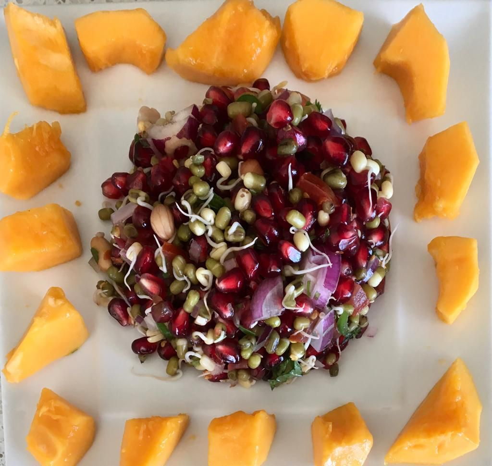
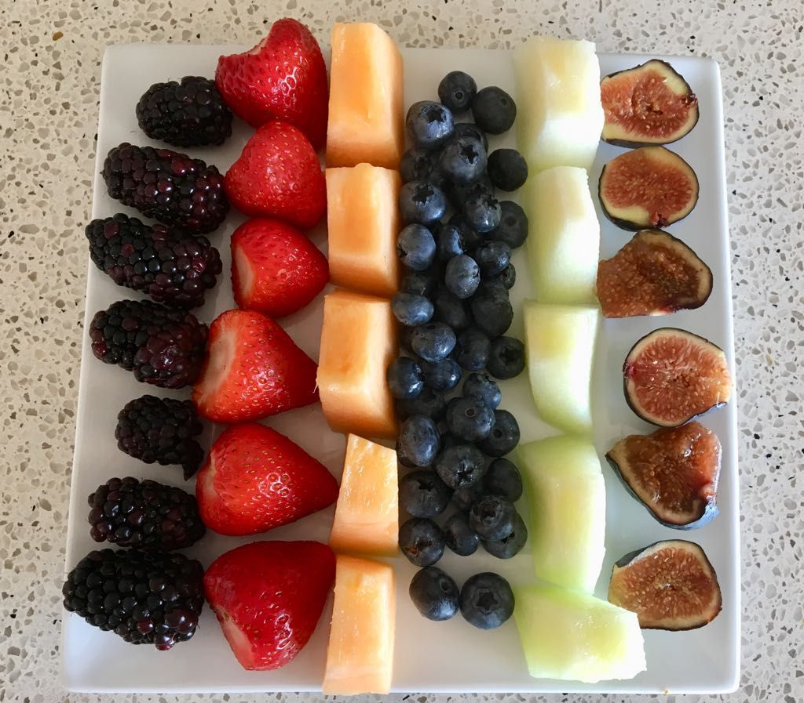
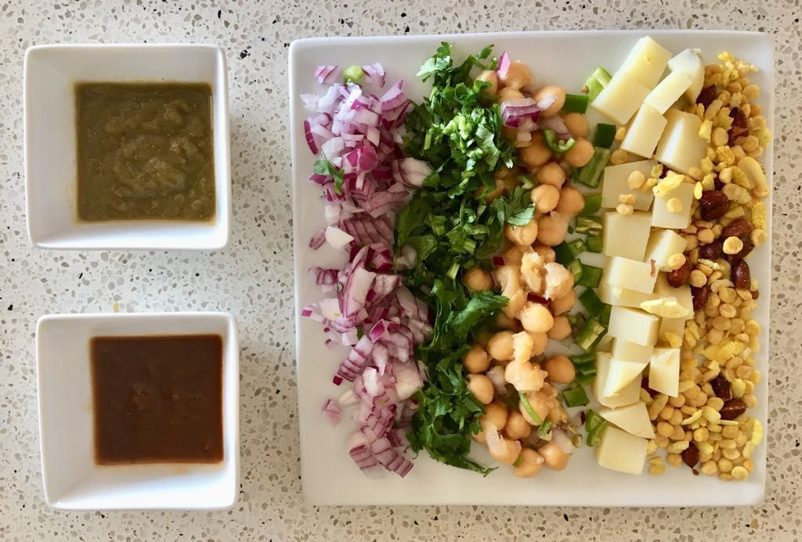
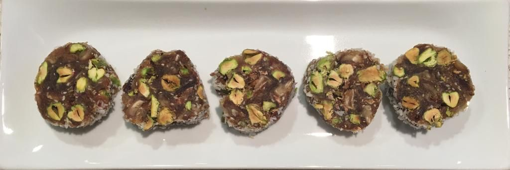
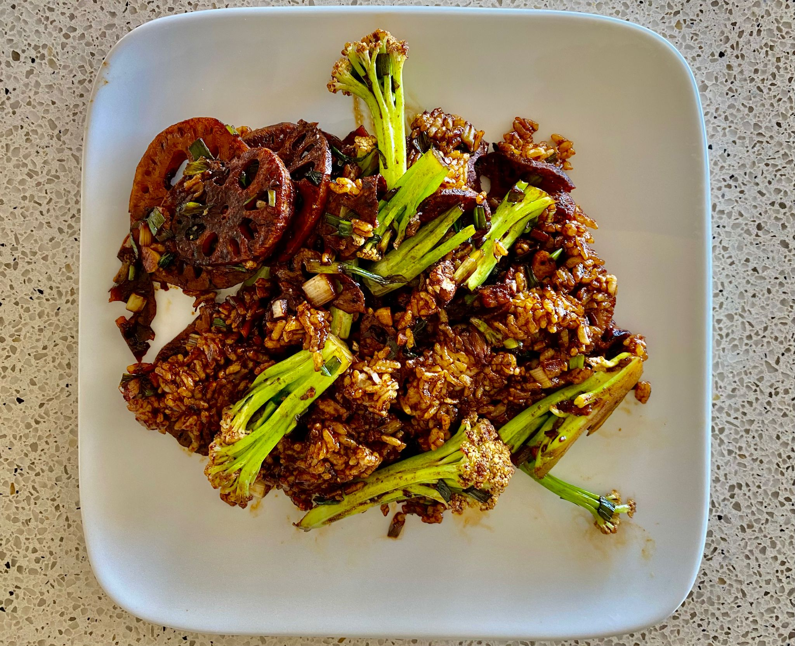

# Meal Plan Suggestions

Many people ask me as to what I eat for meals and what can be made with zero oil and zero sugar. Today’s post is focused on this subject. Here is a list of foods regularly consumed at our home. 

A. Zero Oil Meals appropriate for those who are trying to reverse their chronic diseases and get off medications. 
1. Salads with Avocado, Fruits, Nuts and Seeds
2. Blended Vegetable Soups
3. Rajma, Chawal
4. Cholle, Aloo Chaat
5. Dhania Aloo Chaat
6. Imli Sonth Aloo Chaat
7. Sweet Potato Chaat
8. Cholle with whole wheat Naan or Kulcha
9. Idli, Chutney 
10. Ragda Patties 
11. Khichri with vegetables
12. Sprouted Mung Salad
13. Japanese Spinach with Rice
14. Korean Eggplant Bharta
15. Vietnamese Pho Soups 
16. Thai Spring Rolls with peanut sauce
17. Baked or Hash brown potatoes

B.  5% Oil Meals for those who have already reversed their chronic diseases:
1. Daal, Rice, Roti, Subji
2. Saag, Rice, Roti, Subji
3. Khichri with Vegetables
4. Rice Vegetable Pulao 
5. Ragda Patties
6. Sindhi Kadhi Chawal
7. Rajma Chawal
8. Stuffed Parathas
9. Cholle, Kulcha
10. Idli Sambhar
11. Paper Dosa 
12. Uttapam
13. Upma 
14. Dhokla 
15. Muthia
16. Handwa
17. Poha 
18. Sabudana Khichri 
19. Patra 
20. Cabbage Fried Rice
21. Stir fry veggies & Rice
22. Thai curry & Rice
23. Beyond & Kabab Burgers
24. Falafal or Veggi Kababs with Pita Bread
25. Bhel Puri with Potatoes 

For desserts here are the foods we make regularly. They all require zero sugar and rely heavily on dates, fruits and nuts.
 
1. Baked or boiled Sweet Potatoes make an excellent after meal dessert. I have fond memories of eating it as the last dish after meals specially in winter nights. Unlike potatoes which are always wanting of some salt, pepper or jeera or a little oil to make jeera aloo, sweet potatoes taste great without anything. Okinawan’s, who live the longest lifespan of all communities in the world, get 69% of their daily calories from this one source alone. 
2. Date & Nut Burfi
3. Base of frozen Banana and vanilla Ice cream, with added fresh fruits and nuts. No cream is used. You can add cashew butter. 
4. Chia seed Pudding in coconut or nut milks with dates as sweetener. 
5. Sabudana Pudding in coconut or almond milks with dates and fresh fruits as sweeteners. 

Some suggestions to make food tasty are:
1. To make many whole wheat flour based breads, the key is to add some avocados or nut butter (cashew or peanut) to the dough. 
2. For stir fried dishes instead of oil, use vegetable stock which can be made at home or soya sauce. 
3. For salad dressings, instead of oil, use fruits, like apple, orange, grapefruit, pomelo (chakotra), water melon, leechi etc. you can add lemon juice, ginger juice and a little honey also.

prouted mung with unroasted  peanuts and anaar served with papaya.

Blanched Asparagus and Methi Salad (with onions and peanuts). This is a typical brunch besides green juice, fruits and Oatmeal.

There is nothing wrong with desserts. I take one every evening after dinner. It ust needs to be pbwf. Here is one of my favorite. Pistachio-Date burfy. 

I also eat Japanese sticky rice; it tastes very good with a little soya sauce. Cheap Indian rice; Bhaat also tastes great with rajama. Every body has to find their own taste buds. Do not eat something because it is socially the in thing. For example I have watched the younger hip people paying lot of money for extra virgin olive oil and boasting about it. All nonsense. Why can’t you just have olives. They taste great.

### Few comments:

Stop looking for vegan alternatives to foods like cheese, hamburger, crackers etc..Please remember you goal is to avoid processed foods also. Processed, prepackaged foods are full of GRAS.
Learn how to make various chutnees, make them on Sundays and keep them in your refrigerator. Tamarind chutnee (Sonth) makes any food finger licking good. I find making chaats very easy for a quick meal and chaats have zero oil. In fact if you put oil on Chaat, you spoil the taste.