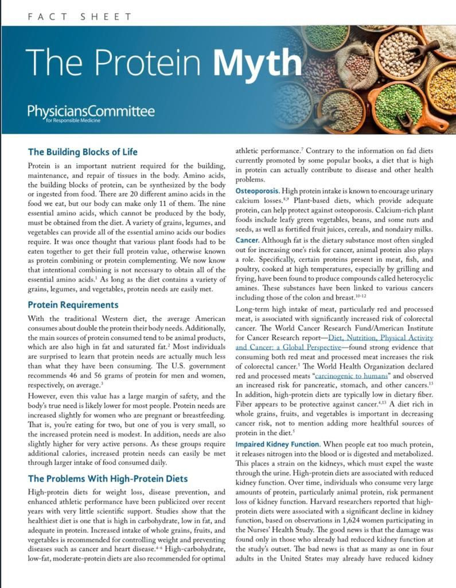

# 2.3 PROTEIN MYTH 

There are only three macronutrients that provide energy (calories) to sustain life;
protein, fat and carbohydrates. Of these only protein has nitrogen; rest are only carbon, hydrogen and oxygen. (Water (H2O) provides hydrogen and oxygen to plants, air provides oxygen and nitrogen and soil provides the minerals. Carbon dioxide that we breathe out is absorbed by the plants during day light and converted into hydro carbons).
Fats and carbohydrates (carbs) are easily convertible into each other and can be stored in the body. Body’s storage capacity for carbs is only 500 +/- grams. It is stored in muscles and liver as glycogen. Rest of the energy storage is in the form of fat; mostly under our skin (subcutaneous fat) and some times adjacent to our internal organs (visceral fat). There is no storage provision for protein in our body. When we eat more protein than needed, which most of us in the civilized world do, (thanks to the myths propagated by the food industry and the ignorant doctors) our body faces a problem. What to do with that extra protein? So the liver which is the chemical factory in our body, removes the nitrogen from the protein and makes ammonia (NH3). Ammonia is toxic and needs to be gotten rid off ASAP from the body. So the body combines it with water and converts it to uric acid and kidney filters it out as urine. 
This taxes two of our critical organs; kidney and liver. This is a leading cause for kidney and liver diseases at later stages in life in the civilized World. 

When there is excess of uric acid, it crystallizes and the body tries to move it as far away as possible from the heart. The farthest point is our big toe and the uric acid crystals are deposited there. This condition is called gout. Many French paintings from the renaissance period show over weight royalties suffering from this pain. 
As a society our protein consumption (from meat eggs and dairy) has increased multi fold over the past century. This has led to many diseases like Hypertension, Diabetes, Heart diseases, Strokes, Dementia, Kidney and Liver diseases. 
Protein as a nutrient was first discovered in 1838. That plants also have protein was learnt only by the end of the 19th century. As a result there has been a bias for animal protein.

Of the various food myths discussed earlier, the one I want to further elaborate on, is misconceptions about protein. 
In the 1950’s, my grandfather insisted I take a glass of milk every morning and night. In the morning he would add one egg yolk to my milk (not to mention the sugar which was always added to milk in India in those days). While I hated drinking it, I had no choice in the matter. Little did he know, that he was causing me harm. He had the best of intentions and based on the prevalent wisdom, at the time, he was doing the right thing. 

Most people know about a project called the “Human Genome Project” which was undertaken during 1990 to 2003 to map genes in the human body.  Few people however are aware of “Human Proteome Project” that  was undertaken, few years later, to study all the proteins in human body. The science emerging from this ongoing project is called Proteomics. For reasons unknown to me, the finding of the Proteomics project are not picked up by the mass media or social media. I believe it may have something to do with its potential impact on the food industry, especially meat, poultry and dairy consumption.  
The human body of a grown up individual makes about 200 grams of new proteins every day and also breaks down about the same amount daily due to wear and tear. The body is very efficient in recycling this protein back into amino acids to make new proteins. Some proteins cannot be recycled such as nails, hair dead skin etc. . New research has shown that about 85% of these proteins get recycled by the body, leaving only a shortfall of 30 grams that we need to consume daily. 
In 1947 the US Government established the minimum protein requirements for an adult at 5-6% of our daily  caloric intake (25-30gm). However, they established the recommended daily allowance at 8-10% amounting to 40-50 grams. The bias for higher protein consumption was so pervasive at the time that even the government felt the need to recommend almost twice the minimum level. This was due to popular beliefs that physical labor and gym enthusiasts need more protein from higher wear and tear on the body, so to cover a broad spectrum of population  a figure of 8-10 percent was arrived at. 
The food industry in its zeal to sell more food, distorted these minimum and recommended guidelines and some how, the recommended daily amount was labeled as the minimum. 
A google search on “protein” will reveal that these distortions appear even on prestigious web sites such as Healthline, WebMD and Harvard Health Blog which I quote below:

“The Recommended Dietary Allowance (RDA) for protein is a modest 0.8 grams of protein per kilogram of body weight. The RDA is the amount of a nutrient you need to meet your basic nutritional requirements. In a sense, it’s the minimum amount you need to keep from getting sick — not the specific amount you are supposed to eat every day.”
The above statement is a total lie. It may surprise you to note that there is not a single recorded case of protein deficiency in the Civilized World.  97% of all Americans eat too much protein while at the same time 97% of all Americans are deficient in dietary fiber in their diets. 
The nutrient of concern therefore should be fiber and not protein. Sadly press coverages on dangers of excessive protein consumption do not exist and the topic is conveniently ignored by the mass media. This is in spite of doctors such as Dr. Collin Campbell and Dr.Janice Stanger speaking about it at conferences, in various documentaries and on YouTube videos. 
Contrary to this pervasive obsession with high protein, the Nobel Prizes for 2016 and 2018 point out that occasional periods of protein deficiency detoxes our body and helps build immunity by a process called autophagy. 
Dr. Honzo (2018 Nobel Laureate) has demonstrated that prolonged fasting or feeding cancer patients diet devoid in protein for stretches of 5-10 days can help build immunity to fight cancer. 

Protein is so abundant in nature that almost all plant based foods have it. Potatoes have 5-6 percent, rice has 7-8 percent, watermelon has 7 percent. The importance of this lesson is this: 

 “One should just stop worrying about protein while on pbwf diet and focus on fiber instead.”

Another misconception about protein is that eating protein builds muscles. Muscles develop when you exercise them. The famous gladiators of the Roman period 2,000 years ago, who had to fight for life every day, were all vegans. Please watch the documentary “The Game Changers”. This is also discussed in the documentary “Forks over Knives”.

Please watch the talk about dangers of excessive protein in the following video by Dr. Janice Stanger who is a Professor at the University of California, SanFrancisco (UCSF).

some people have difficulty in coming to grips with my views on Protein Myth. Here is an article that describes well the subject and you may benefit from reading it. It also has a sizable reference which can be accessed on internet for more information.

The Protein Myth - Artile

