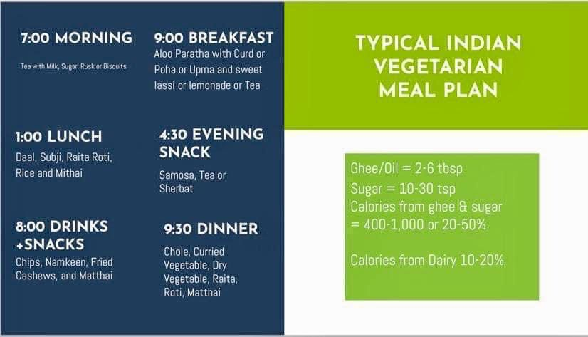

# Typical Indian Meal Plan

This is a typical meal plan of a vegetarian Indian. There are many problems with it. 
1. As you can see, anywhere from 30 to 70 percent of the calories are coming from ghee/oil, sugar and dairy, which are all devoid of fiber.
2. All calories coming from oil, ghee and sugar are empty calories without any micronutrients. This is a big problem. 
4. Also please note that eating window is 15 hours and I haven’t even shown the glass of milk at bedtime. This is very harmful as we will see later when we discuss chronic diseases.

