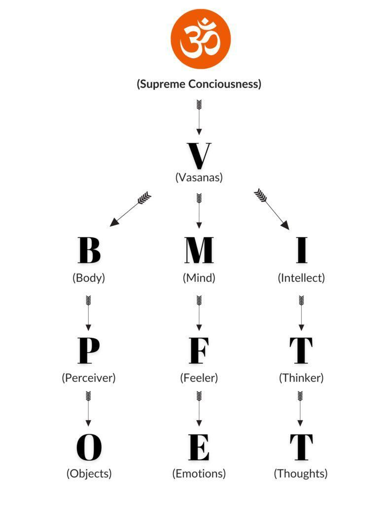

# Yoga

What is Yoga and how it is relevant in a contemporary society. We will spend some time on it in this post. 

Today with world wide spread of Yoga, it has become a generic term to describe many pursuits ranging from simple physical exercises to an elaborate set of principles dictating how we live our life. The sculptures of Mohanjodaro and Harappa are testimony that Yoga was practiced at the time, 5,000 years ago. There is reference to Yoga in Vedas and in fact there are 20 Upanishads dedicated to it, 11 in Atharva Veda alone. The best known among them is Yogatattava Upanishad from Atharva Veda. In Yogatattava Upanishad, Vishnu states to Brahma that Yoga is one, but in practice of various kinds, the chief among those are of four types 
- Mantra Yoga is the practice through chants.
- Laya Yoga through deep concentration.
- Hatha Yoga through exertion.
- Raja Yoga through meditation.

Some say Yoga was first started by Shiva and some credit it to Sage Kapil. Ved Vyas included Yoga in Bhagvat Geeta, in one of the broadest interpretation and each chapter was described as a different Yoga. 

Sage Patanjali’s Yoga Sutra is most widely recognized as the authoritative work on Yoga. It is also a broad interpretation of yoga which includes all aspects of one’s whole life. 

Hath Yoga is a narrower interpretation of yoga and focuses on body’s postures (Asanas), Kriyas (cleansing activities) and Breathing exercises (Pranayama). 
In yoga literature, there are a number of reliable texts on Hatha Yoga written between 6th and 15th centuries AD. Four that stand out among them are 

1. Hatha Yoga Pradeepika by Yogi Swatmarama
2. Goraksha Samhita by Yogi Gorakhnath
3. Gheranda Samhita by great sage Gheranda and
4. Hatharatnavali by Srinivasbhatta Mahayogindra.

Yoga in the 20th century was revived by Krishnamacharya of Mysore who was patronized by the King of Mysore over 100 years ago. His two disciples BKS Iyanger and Patabhi Joice played the key role in spreading yoga throughout the world.

Broadly one can say that Hatha Yoga combined with Karma, Bhakti and Jnyan Yoga disciplines, as preached in Geeta, prepares one to practice meditation. The triangle of the knower, the knowledge and the known, once dissolved, is the ultimate state of being. Achieving this state is Yoga. 

The state of samadhi, achieved through yoga & meditation is not experienced by our sense organs, mind or intellect and therefore indescrigbable in words. But one thing is for sure that it must provide a very happy and peaceful experience, otherwise why would one, after experiencing it, would keep returning to it again and again. 

The knowledge of supreme self and ultimate reality (Brahman) is necessary but not sufficient to realize it. The experience is essential. The experience can not be realized till we streamline our body, mind and intellect through proper disciplines as expounded by Patanjali in his Yogasutra as yam, niyam, asana, pranayama, and pratyahar. In Geeta the recommendation is similar but further classified by one’s aptitude (gunas) into Karma (action), Bhakti (devotion) and Jnyan (knowledge).
When a seeker, who has achieved this balance in life (defined as sthitipragnaya in Geeta as a man of study wisdom), practices concentration (dharana) his meditation (dhyan) is successful and he achieves samadhi. 

Yogatattava Upanishad declares that this realization of the supreme self is possible to the yoga student who is free from "passion, anger, fear, delusion, greed, pride, lust, miserliness, swoon, guiddiness, hunger, thirst, ambition, shame, fright, heart-burning, grief and gladness".

It would not be inappropriate to say that  following the five pillars of health helps one achieve this goal.

